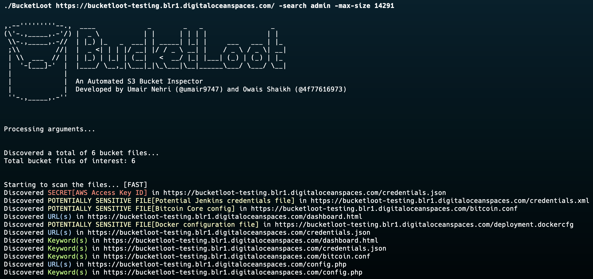

<h1 align="center">BucketLoot</h1>

<b>An Automated S3 Bucket Inspector</b>

<a href="#description">Description</a> • <a href="#features">Features</a> • <a href="docs/documentation.md">Documentation</a> • <a href="#acknowledgements">Acknowledgements</a>

 

<h2> Description </h2>
BucketLoot is an automated S3 bucket inspector that can help users extract assets, flag secret exposures and even search for custom keywords as well as Regular Expressions from publicly-exposed storage buckets by scanning files that store data in plain-text.
  
The tool can scan for buckets deployed on Amazon Web Services (AWS), Google Cloud Storage (GCS), DigitalOcean Spaces and even custom domains/URLs which could be connected to these platforms. It returns the output in a JSON format, thus enabling users to parse it according to their liking or forward it to any other tool for further processing.
  
BucketLoot comes with a guest mode by default, which means a user doesn't needs to specify any API tokens / Access Keys initially in order to run the scan. The tool will scrape a maximum of 1000 files that are returned in the XML response and if the storage bucket contains more than 1000 entries which the user would like to run the scanner on, they can provide platform credentials to run a complete scan.

<h2> Features </h2>

<h4> Secret Scanning </h4>
Scans for over 30+ unique RegEx signatures that can help in uncovering secret exposures from the misconfigured storage bucket. Users have the ability to modify or add their own signatures in the <a href="./regexes.json">regexes.json</a> file. If you believe you have any cool signatures which might be helpful for others too and could be flagged at scale, go ahead and make a PR!

<h4> Asset Extraction </h4>
Interested in stepping up your asset discovery game? BucketLoot extracts all the URLs/Subdomains and Domains that could be present in an exposed storage bucket, enabling you to have a chance of discovering hidden endpoints, thus giving you an edge over the other traditional recon tools.

<h4> Searching </h4>
The tool goes beyond just asset discovery and secret exposure scanning by letting users search for custom keywords and even Regular Expression queries which may help them find exactly what they are looking for.

<h2> Acknowledgements </h2>
<ul type="disc">
<li><a href="https://www.blackhat.com/us-23/arsenal/schedule/#bucketloot---an-automated-s-bucket-inspector-33536">Black Hat USA 2023 [Arsenal]</a></li>
</ul>

*[`To know more about our Attack Surface Management platform, check out NVADR.`](https://redhuntlabs.com/nvadr)*